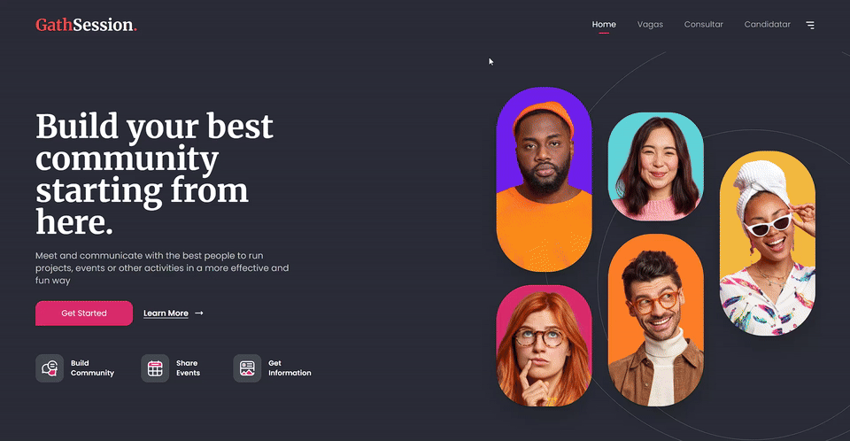

# Naranja Jobs - Job Platform & Full Stack Technical Challenge 🧑🏾‍💻

[](https://nextjs.org/)
[](https://react.dev/)
[](https://www.typescriptlang.org/)
[](https://tailwindcss.com/)
[](https://eslint.org/)
[](https://opensource.org/licenses/MIT)

> 🇧🇷 [**Versão em Português**](README.md) | 🇺🇸 **English Version**

A high-performance Full Stack Web Application built with **Next.js 14 (App Router)**, **React 18**, and **TypeScript**, integrating a pixel-perfect, responsive Figma-based user interface with a protected RESTful API featuring edge middleware and schema validation via Joi.

## 📌 Summary / Quick Navigation

- [📝 About the Project](#-about-the-project)
- [🖼️ Preview](#️-preview)
- [🌐 Live Deployment / Online Demonstration](#-live-deployment--online-demonstration)
- [⚡ API Endpoints](#-api-endpoints)
- [✨ Features](#-features)
- [🛠️ Technologies and Tools](#️-technologies-and-tools)
- [🏛️ Solution Architecture](#️-solution-architecture)
- [📁 Repository Structure](#-repository-structure)
- [💡 Technical Decisions](#-technical-decisions)
- [🚀 Getting Started](#-getting-started)
- [📄 License](#-license)

## 📝 About the Project

This repository originated from the **Junior Full Stack Technical Challenge by NaranjaLabs**. The requirements consisted of:

1. **Frontend:** Implementing the user interface strictly based on the Figma design guidelines and color palette (`#2B2D38`, `#DB2A6B`).
2. **Backend:** Building a RESTful API with Next.js to manage and submit job opportunities (`GET /api/jobs`, `GET /api/job/[id]`, and `POST /api/job/submit`), enforcing payload validation and endpoint authorization via a custom security header (`secret: naranja-labs`).

The project was evolved into a **complete portfolio case study**, removing fixed-width limitations, delivering comprehensive mobile and desktop responsiveness, creating dedicated UI pages for all API functions in the header navigation, and documenting engineering decisions with modern software architecture best practices.

## 🖼️ Preview

<div align="center">
  
</div>

## 🌐 Live Deployment / Online Demonstration

- **Live URL:** *(Coming soon / add your Vercel deployment link here)*
- **API Request Collection:** Includes ready-to-use [`collection_Naranja Labs.json`](./collection_Naranja%20Labs.json) for [Thunder Client](https://marketplace.visualstudio.com/items?itemName=rangav.vscode-thunder-client) or [Postman](https://www.postman.com/).

## ⚡ API Endpoints

All endpoints under `/api/*` are inspected and protected by `middleware.ts`. The following HTTP header is required on all requests:

| Header | Required Value | Description |
| :--- | :--- | :--- |
| `secret` | `naranja-labs` | Security key required for authorization |

> **Note:** Requests missing the secret header or sending an invalid key will return `HTTP 401 Unauthorized`:
> ```json
> {
>   "message": "Secret provided is invalid. Make sure the correct secret is being sent"
> }
> ```

### 1. List Jobs
- **Route:** `GET /api/jobs`
- **Optional level query:** `GET /api/jobs?level=Junior` or `GET /api/jobs?level=Senior`
- **Success Status:** `200 OK`
- **Response Example:**
  ```json
  [
    {
      "id": 1,
      "job": "Full Stack Developer",
      "level": "Junior",
      "status": "open"
    },
    {
      "id": 2,
      "job": "Frontend Developer",
      "level": "Junior",
      "status": "closed"
    }
  ]
  ```

### 2. Get Job by ID
- **Route:** `GET /api/job/[id]`
- **Success Status:** `200 OK`
- **Error Handling:**
  - Missing `id`: `400 Bad Request` (`{"message": "Job ID is required."}`)
  - Non-numeric `id`: `404 Not Found` (`{"message": "ID must be a number."}`)
  - Inexistent `id`: `404 Not Found` (`{"message": "Job ID not found."}`)
- **Response Example (`GET /api/job/1`):**
  ```json
  {
    "id": 1,
    "job": "Full Stack Developer",
    "level": "Junior",
    "status": "open"
  }
  ```

### 3. Submit Job Application
- **Route:** `POST /api/job/submit`
- **Content-Type:** `application/json`
- **Validation:** Enforced via backend Joi schema. All fields are mandatory:
  - `name`: string
  - `age`: number
  - `phone`: string
  - `state`: string
  - `city`: string
- **Request Payload Example:**
  ```json
  {
    "name": "Ludson Pereira",
    "age": 28,
    "phone": "(21) 99108-1759",
    "state": "RJ",
    "city": "Rio de Janeiro"
  }
  ```
- **Success Status:** `201 Created`
  ```json
  {
    "message": "Thank you for your application, Ludson Pereira."
  }
  ```
- **Validation Error:** `400 Bad Request` with a descriptive message regarding the missing or invalid parameter.

## ✨ Features

- 📱 **Fluid Responsive Home:** Hero section faithful to Figma layout using modern CSS Grid & Flexbox, gracefully adapting from compact mobile displays to ultrawide screens without overflow.
- 💼 **Careers Portal (`/jobs`):** Dynamic job listings displaying job ID, title, level, and real-time status badges.
- 🎯 **Instant Experience Level Filtering:** Quick toggle between `All Jobs`, `Junior Level`, and `Senior Level`.
- 🔍 **Direct ID Lookup (`/job-details`):** Interactive UI to test and inspect individual job entries from `GET /api/job/[id]`.
- ✍️ **Application Submission (`/submit-application` & Modal):** Clean, accessible form submission with immediate loading, success, and error feedback.
- 🛡️ **Edge Middleware Protection:** Centralized authentication enforcing security headers across all API routes.
- 🎨 **Solid Design System:** 100% solid, high-contrast surfaces without neon or glass artifacts, preserving original SVGs and typography (Poppins & Merriweather).

## 🛠️ Technologies and Tools

### Core & Frameworks
- **[Next.js 14.1.4](https://nextjs.org/):** React Framework featuring App Router, Route Handlers, and Edge Middleware.
- **[React 18](https://react.dev/):** UI library utilizing functional components and custom hooks.
- **[TypeScript 5](https://www.typescriptlang.org/):** Strict static typing across the entire codebase.

### Styling & UI
- **[Tailwind CSS 3.3](https://tailwindcss.com/):** Modern utility-first responsive styling.
- **[Google Fonts (Next/Font):](https://nextjs.org/docs/app/building-your-application/optimizing/fonts)** Zero-layout-shift optimized font loading (Poppins & Merriweather).

### Validation & Code Quality
- **[Joi 17](https://joi.dev/):** Robust payload and schema validation for API requests.
- **[ESLint 8](https://eslint.org/):** Static code analysis adhering to strict **Airbnb Base** and **Airbnb TypeScript** presets.
- **[PostCSS](https://postcss.org/) & [Autoprefixer](https://github.com/postcss/autoprefixer):** Guaranteed cross-browser CSS compilation.

## 🏛️ Solution Architecture

The application adopts **Separation of Concerns (SoC)** and a clean layered architecture:

```
┌─────────────────────────────────────────────────────────┐
│               Presentation (UI Components)              │
│       Hero Section, JobList, JobCard, JobModal, Form    │
└────────────────────────────┬────────────────────────────┘
                             │
┌────────────────────────────▼────────────────────────────┐
│         State & Business Rules (Custom Hooks)           │
│               useJobs, useApplicationModal             │
└────────────────────────────┬────────────────────────────┘
                             │
┌────────────────────────────▼────────────────────────────┐
│          Data Services (Data Fetching / Service)        │
│            jobService (Injects Secret Headers)          │
└────────────────────────────┬────────────────────────────┘
                             │
┌────────────────────────────▼────────────────────────────┐
│            Next.js Route Handlers (API Backend)         │
│        /api/jobs  •  /api/job/[id]  •  /api/job/submit  │
└────────────────────────────┬────────────────────────────┘
                             │ (Intercepted by)
┌────────────────────────────▼────────────────────────────┐
│                    middleware.ts                        │
│           Edge Authentication Secret Validation         │
└─────────────────────────────────────────────────────────┘
```

## 📁 Repository Structure

```text
fullstack-junior-1/
├── public/
│   └── images/               # Original SVG assets (icons & photo mosaic)
├── src/
│   ├── app/                  # Next.js App Router routes & pages
│   │   ├── api/              # RESTful API Route Handlers
│   │   │   ├── jobs/         # GET /api/jobs
│   │   │   └── job/          # GET /api/job/[id] and POST /api/job/submit
│   │   ├── jobs/             # Page /jobs (Careers Portal)
│   │   ├── job-details/      # Page /job-details (Lookup by ID)
│   │   ├── submit-application/# Page /submit-application (Application form)
│   │   ├── layout.tsx        # Root layout, fonts, and metadata
│   │   ├── page.tsx          # Landing Home page
│   │   ├── globals.css       # Global stylesheet & design tokens
│   │   └── icon.svg          # Custom brand SVG favicon
│   │
│   ├── components/           # Reusable UI components
│   │   ├── hero/             # Headings, CTA buttons, service cards
│   │   ├── jobs/             # Job grid, filter buttons, modal form
│   │   └── ui/               # Atomic components (solid badges)
│   │
│   ├── data/                 # Mock datasets (jobs.ts, navigationData.ts)
│   ├── hooks/                # Custom React hooks (useJobs.ts)
│   ├── services/             # Centralized API service layer (jobService.ts)
│   ├── types/                # TypeScript type definitions (job.ts)
│   ├── utils/                # Fonts configuration & Joi schema validator
│   └── middleware.ts         # Edge authentication middleware
│
├── .eslintrc.json            # ESLint rules configuration (Airbnb preset)
├── next.config.mjs           # Next.js build and memory cache settings
├── package.json              # Project scripts and dependencies
├── tailwind.config.ts        # Tailwind configuration
└── tsconfig.json             # TypeScript strict compiler options
```

## 💡 Technical Decisions

1. **Unified Next.js App Router (Full Stack):** Hosting both frontend client components and API route handlers in a single repository streamlines deployments and maintains end-to-end TypeScript interfaces.
2. **Dedicated `services` Layer:** Component code does not perform raw `fetch` calls. All HTTP requests are encapsulated inside `jobService.ts`, ensuring authorization headers are injected reliably and error payloads are normalized.
3. **100% Solid Surfaces (No AI Slop):** Avoided generic translucent glow/blur styles in favor of solid corporate colors (`#2E7D32` for active status, `#1E2028` for closed, `#22242D` for cards), improving legibility and accessibility.
4. **Windows Cache Conflict Resolution:** Configured in-memory webpack cache during development in `next.config.mjs` to prevent intermittent NTFS file lock errors (`ENOENT`).
5. **Strict Airbnb Code Standards:** Cleaned and validated code against Airbnb ESLint rules to maintain consistency, maintainability, and clean architecture.

## 🚀 Getting Started

### Prerequisites
- [Node.js](https://nodejs.org/) version `18.17.0` or higher
- `npm` or `yarn` package manager

### Installation & Run

1. **Clone the repository:**
   ```bash
   git clone https://github.com/ludson96/fullstack-junior-1.git
   cd fullstack-junior-1
   ```

2. **Install dependencies:**
   ```bash
   npm install
   ```

3. **Start the development server:**
   ```bash
   npm run dev
   ```

4. **Open in your browser:**
   - Navigate to: [http://localhost:3000](http://localhost:3000)

### Available Scripts

| Command | Description |
| :--- | :--- |
| `npm run dev` | Runs the development server on port 3000 |
| `npm run build` | Generates an optimized production build with type checking and linting |
| `npm run start` | Starts the production server (requires `npm run build` first) |
| `npm run lint` | Runs ESLint with strict Airbnb configuration |

## 📄 License

This project is licensed under the **MIT License**. See the [LICENSE](LICENSE) file for more information.

<div align="center">
  Developed by <strong>Ludson Pereira dos Santos</strong> 🚀<br />
  <a href="https://www.linkedin.com/in/ludson96/">LinkedIn</a> • <a href="https://github.com/ludson96">GitHub</a> • <a href="mailto:ludson_ps27@hotmail.com">E-mail</a>
</div>
